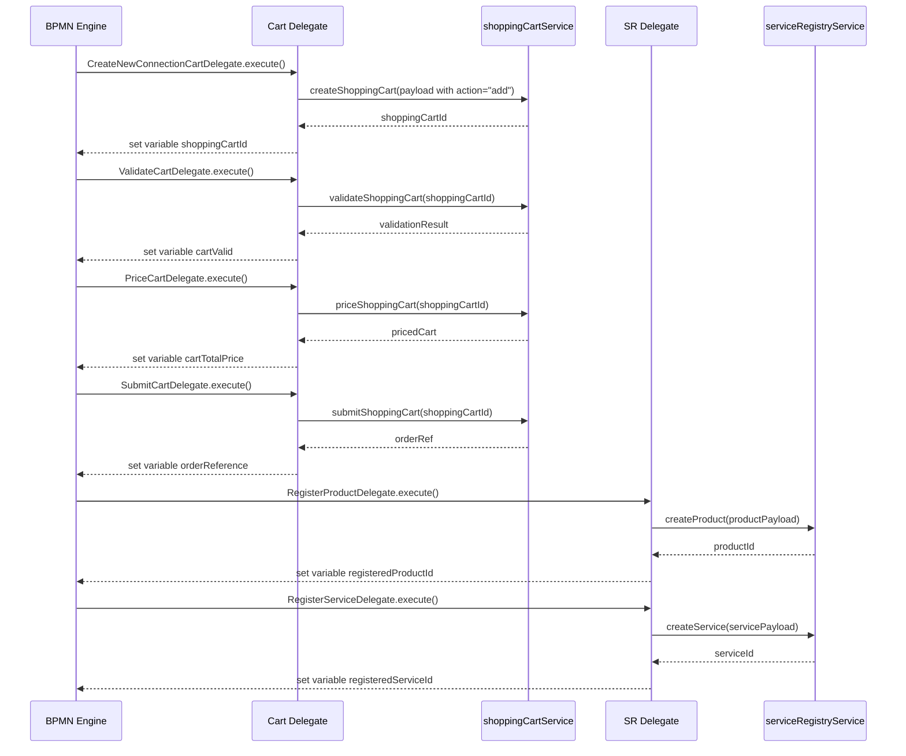
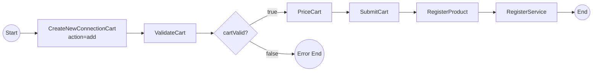
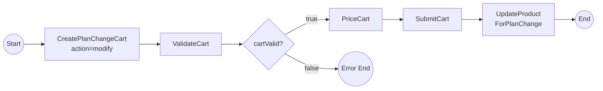
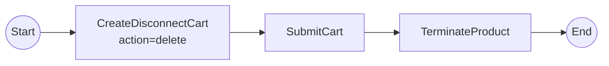
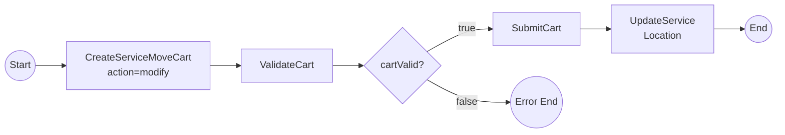
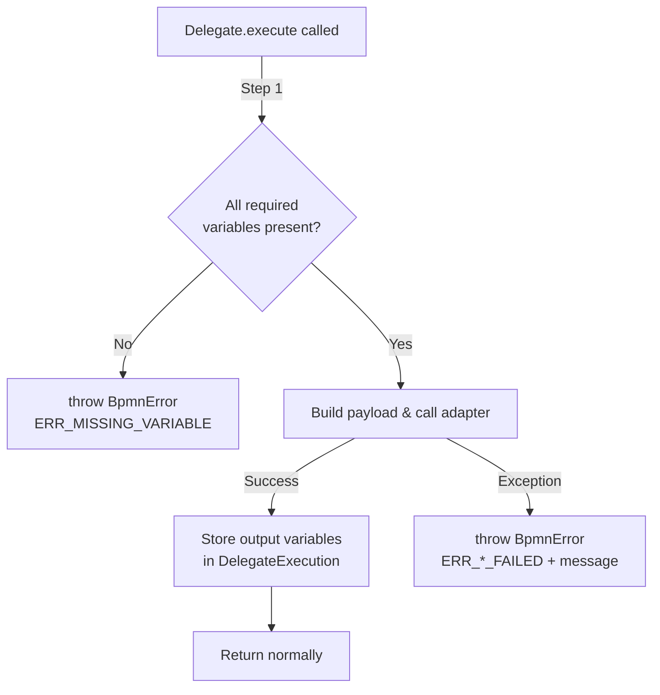

# Design Document: EOC Order Management & Service Registry Delegates

## Overview

This design describes the `ftth-eoc-delegates/` Maven module — a set of Camunda JavaDelegate implementations that bridge the existing FTTH Management System workflows with Ericsson Order Care (EOC). The delegates interact with two EOC adapter beans already available in the Process Controller:

1. **`shoppingCartService`** — TMF773 Shopping Cart operations (create, validate, price, submit)
2. **`serviceRegistryService`** — Product/Service lifecycle CRUD (create, update, patch, search, delete)

The module is packaged as a plain JAR (no embedded server) and deployed directly into EOC's Process Controller classpath. All Spring/Camunda/EOC dependencies are `provided` scope since the Process Controller already supplies them at runtime.

### Design Decisions

| Decision | Rationale |
|----------|-----------|
| Separate module from `ftth-camunda/` | The existing module is a standalone Camunda orchestrator calling the FTTH backend via REST. The new delegates run *inside* EOC's Process Controller with injected adapter beans — fundamentally different deployment model. |
| One delegate per atomic adapter call | Single Responsibility; testable in isolation; reusable across BPMN flows. |
| `provided` scope for all runtime deps | Process Controller (Camunda 7.18 + Spring Boot 2.7) supplies these. Including them would cause classloader conflicts. |
| Placeholder config values via `@Value` | Different EOC environments have different product/service spec IDs. Externalized properties allow deployment without recompilation. |
| BpmnError for all failure paths | Camunda's boundary error events catch BpmnError, enabling BPMN-level error handling without coupling delegates to flow logic. |
| `AbstractEocDelegate` base class | DRY for variable reading, null-checking, and BpmnError construction. |

## Architecture

```mermaid
graph TD
    subgraph "EOC Process Controller (Camunda 7.18, port 8090)"
        BPMN[BPMN Process Definitions]
        subgraph "ftth-eoc-delegates.jar"
            CartDelegates[Shopping Cart Delegates]
            SRDelegates[Service Registry Delegates]
            Config[EocDelegateConfig]
        end
        SCS[shoppingCartService Bean]
        SRS[serviceRegistryService Bean]
    end

    BPMN -->|delegateExpression| CartDelegates
    BPMN -->|delegateExpression| SRDelegates
    CartDelegates -->|@Autowired| SCS
    SRDelegates -->|@Autowired| SRS
    Config -->|@Value| Properties[application.properties]
```

### Flow-Level Sequence (New Connection)



## Components and Interfaces

### Module Layout

```
ftth-eoc-delegates/
├── pom.xml
└── src/
    ├── main/
    │   ├── java/com/aaha/ftth/eoc/delegate/
    │   │   ├── AbstractEocDelegate.java
    │   │   ├── config/
    │   │   │   └── EocDelegateConfig.java
    │   │   ├── cart/
    │   │   │   ├── CreateNewConnectionCartDelegate.java
    │   │   │   ├── CreatePlanChangeCartDelegate.java
    │   │   │   ├── CreateDisconnectCartDelegate.java
    │   │   │   ├── CreateServiceMoveCartDelegate.java
    │   │   │   ├── ValidateCartDelegate.java
    │   │   │   ├── PriceCartDelegate.java
    │   │   │   └── SubmitCartDelegate.java
    │   │   └── registry/
    │   │       ├── RegisterProductDelegate.java
    │   │       ├── RegisterServiceDelegate.java
    │   │       ├── UpdateProductForPlanChangeDelegate.java
    │   │       ├── TerminateProductDelegate.java
    │   │       └── UpdateServiceLocationDelegate.java
    │   └── resources/
    │       ├── application.properties
    │       └── bpmn/
    │           ├── EOC_FTTH_New_Connection.bpmn
    │           ├── EOC_FTTH_Plan_Change.bpmn
    │           ├── EOC_FTTH_Disconnect.bpmn
    │           └── EOC_FTTH_Service_Move.bpmn
    └── test/
        └── java/com/aaha/ftth/eoc/delegate/
```

### AbstractEocDelegate (Base Class)

```java
public abstract class AbstractEocDelegate implements JavaDelegate {

    protected <T> T getRequiredVariable(DelegateExecution execution, String name, Class<T> type) {
        Object value = execution.getVariable(name);
        if (value == null) {
            throw new BpmnError("ERR_MISSING_VARIABLE",
                "Required variable '" + name + "' is missing or null");
        }
        return type.cast(value);
    }

    protected String getRequiredString(DelegateExecution execution, String name) {
        return getRequiredVariable(execution, name, String.class);
    }

    protected Long getRequiredLong(DelegateExecution execution, String name) {
        return ((Number) getRequiredVariable(execution, name, Number.class)).longValue();
    }

    protected Object getOptionalVariable(DelegateExecution execution, String name) {
        return execution.getVariable(name);
    }
}
```

### EocDelegateConfig

```java
@Configuration
@ComponentScan("com.aaha.ftth.eoc.delegate")
public class EocDelegateConfig {

    @Value("${eoc.ftth.product-spec-id:PLACEHOLDER_PRODUCT_SPEC}")
    private String productSpecId;

    @Value("${eoc.ftth.service-spec-id:PLACEHOLDER_SERVICE_SPEC}")
    private String serviceSpecId;

    @Value("${eoc.ftth.catalog-id:PLACEHOLDER_CATALOG}")
    private String catalogId;

    public String getProductSpecId() { return productSpecId; }
    public String getServiceSpecId() { return serviceSpecId; }
    public String getCatalogId() { return catalogId; }
}
```

### Shopping Cart Delegates

| Delegate | Bean Name | Adapter Method | Input Variables | Output Variables |
|----------|-----------|----------------|-----------------|------------------|
| CreateNewConnectionCartDelegate | `createNewConnectionCartDelegate` | `createShoppingCart()` | customerName, email, planId, pincode, oltType | shoppingCartId |
| CreatePlanChangeCartDelegate | `createPlanChangeCartDelegate` | `createShoppingCart()` | connectionId, customerId, newPlanId | shoppingCartId |
| CreateDisconnectCartDelegate | `createDisconnectCartDelegate` | `createShoppingCart()` | connectionId, customerId | shoppingCartId |
| CreateServiceMoveCartDelegate | `createServiceMoveCartDelegate` | `createShoppingCart()` | connectionId, customerId, newPincode, newPortId, newOltCode | shoppingCartId |
| ValidateCartDelegate | `validateCartDelegate` | `validateShoppingCart()` | shoppingCartId | cartValid, cartValidationErrors |
| PriceCartDelegate | `priceCartDelegate` | `priceShoppingCart()` | shoppingCartId | cartTotalPrice |
| SubmitCartDelegate | `submitCartDelegate` | `submitShoppingCart()` | shoppingCartId | orderReference |

### Service Registry Delegates

| Delegate | Bean Name | Adapter Method | Input Variables | Output Variables |
|----------|-----------|----------------|-----------------|------------------|
| RegisterProductDelegate | `registerProductDelegate` | `createProduct()` | planId, planName, monthlyPrice, oltType, customerCode | registeredProductId |
| RegisterServiceDelegate | `registerServiceDelegate` | `createService()` | portId, oltCode, splitterNumber, pincode, registeredProductId | registeredServiceId |
| UpdateProductForPlanChangeDelegate | `updateProductForPlanChangeDelegate` | `updateProduct()` / `searchProducts()` | registeredProductId (or customerCode fallback), newPlanId, planName, monthlyPrice, oltType | — |
| TerminateProductDelegate | `terminateProductDelegate` | `patchProduct()` + `patchService()` | registeredProductId, registeredServiceId (or customerCode fallback) | — |
| UpdateServiceLocationDelegate | `updateServiceLocationDelegate` | `updateService()` / `searchServices()` | registeredServiceId (or customerCode fallback), newPincode, newPortId, newOltCode, newSplitterNumber | — |

### BPMN Process Definitions

#### New Connection Flow



#### Plan Change Flow



#### Disconnect Flow



#### Service Move Flow



Each BPMN definition includes:
- Service tasks using `camunda:delegateExpression="${beanName}"`
- Boundary error events on all service tasks catching `BpmnError` by error code
- Error end events for each error code
- Exclusive gateway after ValidateCartDelegate checking `${cartValid == true}`

## Data Models

### Process Variable Contract

| Variable | Type | Source | Used By |
|----------|------|--------|---------|
| `customerName` | String | Upstream workflow | CreateNewConnectionCartDelegate |
| `email` | String | Upstream workflow | CreateNewConnectionCartDelegate |
| `customerCode` | String | Upstream workflow | Registry delegates, fallback search |
| `customerId` | String | Upstream workflow | PlanChange/Disconnect/Move cart delegates |
| `connectionId` | String | Upstream workflow | PlanChange/Disconnect/Move cart delegates |
| `planId` | Long | Upstream workflow | CreateNewConnectionCartDelegate, RegisterProductDelegate |
| `planName` | String | Upstream workflow | RegisterProductDelegate, UpdateProductForPlanChangeDelegate |
| `monthlyPrice` | Double | Upstream workflow | RegisterProductDelegate, UpdateProductForPlanChangeDelegate |
| `oltType` | String | Upstream workflow | CreateNewConnectionCartDelegate, RegisterProductDelegate |
| `pincode` | Long | Upstream workflow | CreateNewConnectionCartDelegate, RegisterServiceDelegate |
| `portId` | String | Upstream workflow | RegisterServiceDelegate |
| `oltCode` | String | Upstream workflow | RegisterServiceDelegate |
| `splitterNumber` | String | Upstream workflow | RegisterServiceDelegate |
| `newPlanId` | Long | Upstream workflow | CreatePlanChangeCartDelegate, UpdateProductForPlanChangeDelegate |
| `newPincode` | Long | Upstream workflow | CreateServiceMoveCartDelegate, UpdateServiceLocationDelegate |
| `newPortId` | String | Upstream workflow | CreateServiceMoveCartDelegate, UpdateServiceLocationDelegate |
| `newOltCode` | String | Upstream workflow | CreateServiceMoveCartDelegate, UpdateServiceLocationDelegate |
| `newSplitterNumber` | String | Upstream workflow | UpdateServiceLocationDelegate |
| `shoppingCartId` | String | Cart creation delegates | Validate/Price/Submit delegates |
| `cartValid` | Boolean | ValidateCartDelegate | BPMN exclusive gateway |
| `cartValidationErrors` | String | ValidateCartDelegate | Error handling/logging |
| `cartTotalPrice` | Double | PriceCartDelegate | Downstream/audit |
| `orderReference` | String | SubmitCartDelegate | Downstream processes |
| `registeredProductId` | String | RegisterProductDelegate | RegisterService, UpdateProduct, TerminateProduct |
| `registeredServiceId` | String | RegisterServiceDelegate | TerminateProduct, UpdateServiceLocation |

### Shopping Cart Payload (TMF773)

```json
{
  "cartItem": [
    {
      "action": "add|modify|delete",
      "productOffering": {
        "id": "${config.productSpecId}",
        "name": "FTTH Subscription"
      },
      "product": {
        "productSpecification": {
          "id": "${config.productSpecId}"
        },
        "productCharacteristic": [
          { "name": "planId", "value": "..." },
          { "name": "planName", "value": "..." },
          { "name": "oltType", "value": "..." },
          { "name": "pincode", "value": "..." }
        ],
        "relatedParty": [
          { "id": "${customerCode}", "role": "customer" }
        ]
      }
    }
  ]
}
```

### Service Registry — Product Payload

```json
{
  "productSpecification": { "id": "${config.productSpecId}" },
  "status": "active",
  "productCharacteristic": [
    { "name": "planId", "value": "..." },
    { "name": "planName", "value": "..." },
    { "name": "monthlyPrice", "value": "..." },
    { "name": "oltType", "value": "..." }
  ],
  "relatedParty": [
    { "id": "${customerCode}", "role": "customer" }
  ]
}
```

### Service Registry — Service Payload

```json
{
  "serviceSpecification": { "id": "${config.serviceSpecId}" },
  "status": "active",
  "serviceCharacteristic": [
    { "name": "portId", "value": "..." },
    { "name": "oltCode", "value": "..." },
    { "name": "splitterNumber", "value": "..." },
    { "name": "pincode", "value": "..." }
  ],
  "supportingProduct": [
    { "id": "${registeredProductId}" }
  ],
  "relatedParty": [
    { "id": "${customerCode}", "role": "customer" }
  ]
}
```

### Maven POM (pom.xml)

```xml
<?xml version="1.0" encoding="UTF-8"?>
<project xmlns="http://maven.apache.org/POM/4.0.0"
         xmlns:xsi="http://www.w3.org/2001/XMLSchema-instance"
         xsi:schemaLocation="http://maven.apache.org/POM/4.0.0
                             https://maven.apache.org/xsd/maven-4.0.0.xsd">
    <modelVersion>4.0.0</modelVersion>

    <groupId>com.aaha.ftth</groupId>
    <artifactId>ftth-eoc-delegates</artifactId>
    <version>1.0.0</version>
    <packaging>jar</packaging>
    <name>FTTH EOC Delegates</name>
    <description>Camunda delegates for EOC Process Controller integration</description>

    <properties>
        <java.version>17</java.version>
        <maven.compiler.source>17</maven.compiler.source>
        <maven.compiler.target>17</maven.compiler.target>
        <camunda.version>7.18.0</camunda.version>
        <spring.version>5.3.31</spring.version>
    </properties>

    <dependencies>
        <!-- PROVIDED: Supplied by EOC Process Controller at runtime -->
        <dependency>
            <groupId>org.camunda.bpm</groupId>
            <artifactId>camunda-engine</artifactId>
            <version>${camunda.version}</version>
            <scope>provided</scope>
        </dependency>
        <dependency>
            <groupId>org.springframework</groupId>
            <artifactId>spring-context</artifactId>
            <version>${spring.version}</version>
            <scope>provided</scope>
        </dependency>
        <dependency>
            <groupId>org.springframework</groupId>
            <artifactId>spring-beans</artifactId>
            <version>${spring.version}</version>
            <scope>provided</scope>
        </dependency>

        <!-- TEST -->
        <dependency>
            <groupId>org.junit.jupiter</groupId>
            <artifactId>junit-jupiter</artifactId>
            <version>5.10.2</version>
            <scope>test</scope>
        </dependency>
        <dependency>
            <groupId>org.mockito</groupId>
            <artifactId>mockito-core</artifactId>
            <version>5.11.0</version>
            <scope>test</scope>
        </dependency>
        <dependency>
            <groupId>net.jqwik</groupId>
            <artifactId>jqwik</artifactId>
            <version>1.8.2</version>
            <scope>test</scope>
        </dependency>
    </dependencies>

    <build>
        <plugins>
            <plugin>
                <groupId>org.apache.maven.plugins</groupId>
                <artifactId>maven-compiler-plugin</artifactId>
                <version>3.11.0</version>
                <configuration>
                    <source>17</source>
                    <target>17</target>
                </configuration>
            </plugin>
        </plugins>
    </build>
</project>
```


## Correctness Properties

*A property is a characteristic or behavior that should hold true across all valid executions of a system — essentially, a formal statement about what the system should do. Properties serve as the bridge between human-readable specifications and machine-verifiable correctness guarantees.*

### Property 1: Cart payload action correctness

*For any* valid set of DelegateExecution variables and any of the four cart creation delegates, the Shopping Cart payload passed to `shoppingCartService.createShoppingCart()` SHALL contain the correct action type ("add" for New Connection, "modify" for Plan Change and Service Move, "delete" for Disconnect) and SHALL include all required fields populated from the corresponding process variables.

**Validates: Requirements 2.1, 2.2, 2.3, 2.4**

### Property 2: Adapter return value round-trip storage

*For any* delegate that produces output variables, and *for any* value returned by the adapter bean method, that value SHALL be stored in the DelegateExecution under the designated output variable name (`shoppingCartId`, `orderReference`, `registeredProductId`, `registeredServiceId`, `cartTotalPrice`) and retrieving it from the execution SHALL yield the same value.

**Validates: Requirements 2.5, 4.2, 5.2, 6.2, 6.4**

### Property 3: Exception-to-BpmnError conversion

*For any* delegate and *for any* exception thrown by its underlying adapter bean method, the delegate SHALL throw a `BpmnError` whose error code matches the designated code for that delegate and whose error message SHALL contain the original exception message text.

**Validates: Requirements 2.6, 3.4, 4.3, 5.3, 6.5, 6.6, 7.3, 8.4, 9.3**

### Property 4: Missing required variable produces ERR_MISSING_VARIABLE

*For any* delegate and *for any* required process variable that is null or missing from the DelegateExecution, the delegate SHALL throw a `BpmnError` with error code `ERR_MISSING_VARIABLE` and the error message SHALL include the name of the missing variable.

**Validates: Requirements 11.4**

### Property 5: Validation result mapping

*For any* response from `shoppingCartService.validateShoppingCart()`, if the result indicates success then `cartValid` SHALL be `true`; if the result contains validation errors then `cartValid` SHALL be `false` and `cartValidationErrors` SHALL contain the complete error details from the adapter response.

**Validates: Requirements 3.2, 3.3**

### Property 6: Termination sets both product and service lifecycle statuses

*For any* valid `registeredProductId` and `registeredServiceId` present in DelegateExecution, the TerminateProductDelegate SHALL invoke `patchProduct()` with status "terminated" AND invoke `patchService()` with status "inactive", ensuring both transitions always occur together atomically.

**Validates: Requirements 8.1, 8.2**

### Property 7: Cart ID passthrough integrity

*For any* Shopping Cart identifier stored in the `shoppingCartId` process variable, the ValidateCartDelegate, PriceCartDelegate, and SubmitCartDelegate SHALL pass that exact value (unmodified) to their respective adapter methods.

**Validates: Requirements 3.1, 4.1, 5.1**

### Property 8: Service Registry payload field completeness

*For any* valid set of process variables, the RegisterProductDelegate payload SHALL contain all plan characteristics (planId, planName, monthlyPrice, oltType) and customer reference; and the RegisterServiceDelegate payload SHALL contain all physical connection characteristics (portId, oltCode, splitterNumber, pincode) and a reference to registeredProductId.

**Validates: Requirements 6.1, 6.3**

### Property 9: Fallback search when primary identifier is missing

*For any* registry update delegate (UpdateProductForPlanChangeDelegate, TerminateProductDelegate, UpdateServiceLocationDelegate) where the primary identifier variable is null or absent, the delegate SHALL invoke the corresponding search method (`searchProducts` or `searchServices`) using the customer reference before performing the update operation.

**Validates: Requirements 7.2, 8.3, 9.2**

## Error Handling

### Error Propagation Flow



### Error Code Reference

| Error Code | Delegate(s) | Trigger | Recovery Action |
|-----------|-------------|---------|-----------------|
| `ERR_MISSING_VARIABLE` | All | Required process variable null/absent | Fix upstream workflow step |
| `ERR_CART_CREATION_FAILED` | Create*CartDelegates | `createShoppingCart()` exception | Retry; check EOC adapter logs |
| `ERR_CART_VALIDATION_FAILED` | ValidateCartDelegate | `validateShoppingCart()` exception | Check cart contents, retry |
| `ERR_CART_PRICING_FAILED` | PriceCartDelegate | `priceShoppingCart()` exception | Check product catalog config |
| `ERR_CART_SUBMISSION_FAILED` | SubmitCartDelegate | `submitShoppingCart()` exception | Retry; check fulfillment pipeline |
| `ERR_PRODUCT_REGISTRATION_FAILED` | RegisterProductDelegate | `createProduct()` exception | Check SR availability |
| `ERR_SERVICE_REGISTRATION_FAILED` | RegisterServiceDelegate | `createService()` exception | Check SR availability |
| `ERR_PRODUCT_UPDATE_FAILED` | UpdateProductForPlanChangeDelegate | `updateProduct()` exception | Verify product exists in SR |
| `ERR_PRODUCT_TERMINATION_FAILED` | TerminateProductDelegate | `patchProduct()` exception | Verify product is active |
| `ERR_SERVICE_LOCATION_UPDATE_FAILED` | UpdateServiceLocationDelegate | `updateService()` exception | Verify service exists in SR |

### BPMN-Level Error Handling

- Each service task has a **boundary error event** catching the delegate's specific error code
- Caught errors route to an **error end event** that terminates the process instance with the error code as output
- The validation gateway (`cartValid == false`) is a normal business outcome, not an exception — it routes to a dedicated error end event

### Fallback Strategy for Missing Identifiers

Registry update delegates (7.2, 8.3, 9.2) implement a two-step lookup:
1. Check if primary identifier variable (`registeredProductId` / `registeredServiceId`) is present
2. If absent, call `searchProducts()` or `searchServices()` with `customerCode` as a filter
3. If search returns a result, proceed with the update using the found identifier
4. If search returns no results, throw `BpmnError("ERR_MISSING_VARIABLE", ...)`

## Testing Strategy

### Test Framework Stack

| Tool | Purpose |
|------|---------|
| JUnit 5 | Test runner |
| Mockito 5.x | Mocking EOC adapter beans and DelegateExecution |
| jqwik 1.8.x | Property-based testing for universal correctness properties |
| Camunda BPM Assert | BPMN integration tests (optional, for process-level verification) |

### Property-Based Tests (jqwik)

Each correctness property maps to one property-based test. All use mocked adapter beans and DelegateExecution instances.

**Configuration:**
- Minimum 100 iterations per property: `@Property(tries = 100)`
- Tag format: `@Tag("Feature: eoc-order-management-service-registry, Property N: description")`

**Generators needed:**
- `@Provide Arbitrary<Map<String, Object>> validNewConnectionVars()` — random customerName, email, planId, pincode, oltType
- `@Provide Arbitrary<Map<String, Object>> validPlanChangeVars()` — random connectionId, customerId, newPlanId
- `@Provide Arbitrary<Map<String, Object>> validDisconnectVars()` — random connectionId, customerId
- `@Provide Arbitrary<Map<String, Object>> validServiceMoveVars()` — random connectionId, customerId, newPincode, newPortId, newOltCode
- `@Provide Arbitrary<String> randomAdapterReturnValues()` — random IDs, references
- `@Provide Arbitrary<RuntimeException> randomExceptions()` — random exception messages

**Example test structure:**

```java
@Property(tries = 100)
@Tag("Feature: eoc-order-management-service-registry, Property 1: Cart payload action correctness")
void newConnectionCartPayloadHasCorrectActionAndFields(
    @ForAll("validNewConnectionVars") Map<String, Object> vars
) {
    // Arrange
    DelegateExecution mockExecution = mockExecutionWith(vars);
    ArgumentCaptor<Object> payloadCaptor = ArgumentCaptor.forClass(Object.class);
    when(shoppingCartService.createShoppingCart(payloadCaptor.capture()))
        .thenReturn(Map.of("id", "cart-123"));

    // Act
    delegate.execute(mockExecution);

    // Assert
    Object payload = payloadCaptor.getValue();
    assertThat(extractAction(payload)).isEqualTo("add");
    assertThat(extractCharacteristic(payload, "planId"))
        .isEqualTo(String.valueOf(vars.get("planId")));
    assertThat(extractCharacteristic(payload, "pincode"))
        .isEqualTo(String.valueOf(vars.get("pincode")));
}
```

### Unit Tests (Example-Based)

Each delegate gets focused unit tests for:
- **Happy path** with realistic FTTH data (1-2 tests per delegate)
- **Error path** verifying BpmnError when adapter throws
- **Missing variable path** verifying ERR_MISSING_VARIABLE

Unit tests are intentionally few per delegate — the property tests provide comprehensive input coverage.

### Integration Tests

BPMN process-level tests (optional, heavier):
- Deploy BPMN into in-memory Camunda engine
- Verify correct task execution order for each happy path
- Verify `cartValid == false` gateway routes to error end
- Verify boundary error events catch delegate BpmnErrors

### Test Module Structure

```
ftth-eoc-delegates/src/test/java/com/aaha/ftth/eoc/delegate/
├── cart/
│   ├── CreateNewConnectionCartDelegateTest.java       (unit)
│   ├── CreatePlanChangeCartDelegateTest.java          (unit)
│   ├── CreateDisconnectCartDelegateTest.java          (unit)
│   ├── CreateServiceMoveCartDelegateTest.java         (unit)
│   ├── CartDelegatePropertyTest.java                  (property: P1, P2, P3, P7)
│   ├── ValidateCartDelegateTest.java                  (unit)
│   └── ValidateCartDelegatePropertyTest.java          (property: P5)
├── registry/
│   ├── RegisterProductDelegateTest.java               (unit)
│   ├── RegisterServiceDelegateTest.java               (unit)
│   ├── RegistryDelegatePropertyTest.java              (property: P8, P9)
│   ├── TerminateProductDelegateTest.java              (unit)
│   └── TerminateProductDelegatePropertyTest.java      (property: P6)
├── AbstractEocDelegateTest.java                       (property: P4)
└── bpmn/
    ├── NewConnectionProcessIT.java                    (integration)
    ├── PlanChangeProcessIT.java                       (integration)
    ├── DisconnectProcessIT.java                       (integration)
    └── ServiceMoveProcessIT.java                      (integration)
```
